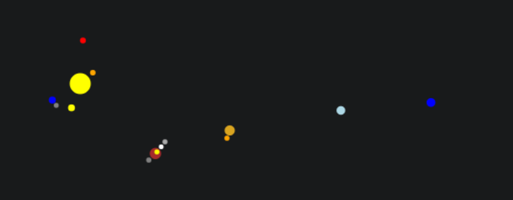

# nBody physics test with scaling

This is just a quick and dirty canvas rendering test for an n-body planetary physics and some logarithmic scaling for orbital distances and planet radii, including exaggerating moon orbits based on the dominant body. It's not perfect by any means as the orbits can teleport if a new dominant body is picked up, the timestep is not continuous, and the scaling could be fine tuned.




```js

document.body.insertAdjacentHTML('afterbegin',`
    <canvas id="solarSystem" width="800" height="800"></canvas>
`);

const canvas = document.getElementById('solarSystem');
const ctx = canvas.getContext('2d');

// Constants
const G = 6.67430e-11; // Gravitational constant
const timeStep = 3600; // One hour in seconds
const AU = 1.496e11; // One Astronomical Unit (distance from Earth to Sun) in meters

let logDistanceScalingFactor = 0.0000000000005;


/** e.g.
 * planet: {
 *  name:'Eeyarth'
 *  mass:3e23,
 * 
 *  distance:1, 
 *    //OR
 *  x: 1.2*AU,
 *  y: 0.5*AU,
 * 
 *  velocity: 47.87e3,
 *    //OR
 *  velocityX:50e3,
 *  velocityY:20e2,
 * 
 *  color:'blue'
 * }
 * 
 */

// Solar system planets configurations
const solarSystemConfig = [
    { 
        name:'Sun',
        mass: 1.989e30, // Mass of the Sun in kilograms
        distance:0,
        velocity:0,
        color:'yellow'
    },
    {
        name: "Mercury",
        mass: 3.3011e23,
        distance: 0.387, //AU
        velocity: 47.87e3,
        color:'orange'
    },
    {
        name: "Venus",
        mass: 4.8675e24,
        distance: 0.723,
        velocity: 35.02e3,
        color:'yellow'
    },
    {
        name: "Earth",
        mass: 5.97237e24,
        distance: 1,
        velocity: 29.78e3,
        color:'blue'
    },
    {
        name: "Earth's Moon",
        mass: 7.342e22,
        distance: 1.00257, // Slightly more than 1 AU to account for Earth-Moon distance
        velocity: 29.78e3 + 1.022e3, // Earth's velocity + additional Moon's orbital velocity
        color:'gray'
    },
    {
        name: "Mars",
        mass: 6.4171e23,
        distance: 1.524,
        velocity: 24.07e3,
        color:'red'
    },
  // Outer planets and their moons
  {
    name: "Jupiter",
    mass: 1.898e27,
    distance: 5.2,
    velocity: 13.07e3,
    color:'brown'
  },
  {
    name: "Io",
    mass: 8.9319e22,
    distance: 5.2 + 0.002821,
    velocity: 13.07e3 + 17.334e3,
    color:'yellow'
  },
  {
    name: "Europa",
    mass: 4.7998e22,
    distance: 5.2 + 0.004486,
    velocity: 13.07e3 + 13.74e3,
    color:'white'
  },
  {
    name: "Ganymede",
    mass: 1.4819e23,
    distance: 5.2 + 0.007155,
    velocity: 13.07e3 + 10.88e3,
    color:'gray'
  },
  {
    name: "Callisto",
    mass: 1.0759e23,
    distance: 5.2 + 0.012585,
    velocity: 13.07e3 + 8.204e3,
    color:'darkgray'
  },
  {
    name: "Saturn",
    mass: 5.683e26,
    distance: 9.5,
    velocity: 9.68e3,
    color:'goldenrod'
  },
  {
    name: "Titan",
    mass: 1.3452e23,
    distance: 9.5 + 0.008168,
    velocity: 9.68e3 + 5.57e3,
    color:'orange'
  },
  {
    name: "Uranus",
    mass: 8.681e25,
    distance: 19.8,
    velocity: 6.81e3,
    color: 'lightblue'
  },
  {
    name: "Neptune",
    mass: 1.024e26,
    distance: 30.1,
    velocity: 5.43e3,
    color: 'blue'
  }
  // Add other planets if needed
];

function generateSolarSystem(planetConfigs) {
  return planetConfigs.map(config => ({
    name: config.name,
    mass: config.mass,
    x: config.x ? config.x : config.distance * AU, //provide x and y in meters or distance in AU
    y: config.y ? config.y : config.distanceY ? config.distanceY : 0,
    vx: config.velocityX ? config.velocityX : 0,
    vy: config.velocity ? config.velocity : config.velocityY ? config.velocityY : 0,
    color:config.color
  }));
}

// Generate the planets
const planets = generateSolarSystem(solarSystemConfig);
  
// Find the largest body to exclude it from the exaggeration
const largestBody = planets.reduce((prev, current) => (prev.mass > current.mass) ? prev : current);
  
// Find the farthest planet to set the scale factor accordingly
let scaleFactor;
const farthestPlanetDistance = Math.max(...solarSystemConfig.map(config => config.distance));
function drawSystem() {
    if (!scaleFactor) {
      // The maximum distance we expect to encounter in the system, which will be scaled down to fit the canvas
      const maxExpectedDistance = Math.log10(farthestPlanetDistance * AU + 1);
      scaleFactor = Math.min(canvas.width, canvas.height) / (2 * maxExpectedDistance);
    }
  
    ctx.clearRect(0, 0, canvas.width, canvas.height); // Clear the canvas
  
    // Draw the planets
    planets.forEach(planet => {
        ctx.beginPath();
    
        let exaggeratedX = planet.x;
        let exaggeratedY = planet.y;
    
        if (planet !== largestBody && planet.mostInfluentialBody && planet.mostInfluentialBody !== largestBody) {
            let orbitExaggerationFactor = 100;
            const dx = planet.x - planet.mostInfluentialBody.x;
            const dy = planet.y - planet.mostInfluentialBody.y;
            exaggeratedX = planet.mostInfluentialBody.x + dx * orbitExaggerationFactor;
            exaggeratedY = planet.mostInfluentialBody.y + dy * orbitExaggerationFactor;
        }
    
      // Apply a logarithmic transformation to the distances from the center
        const distanceFromCenter = Math.sqrt(planet.x ** 2 + planet.y ** 2);
        const logDistance = distanceFromCenter > 1 ? Math.pow(distanceFromCenter*logDistanceScalingFactor*scaleFactor/2, 0.7) : 0; // Avoid log(0) by adding 1

        // Convert polar coordinates (logDistance, angle) to Cartesian coordinates (x, y)
        const angle = Math.atan2(exaggeratedY, exaggeratedX);
        const planetX = (canvas.width / 2) + (Math.cos(angle) * logDistance * scaleFactor);
        const planetY = (canvas.height / 2) + (Math.sin(angle) * logDistance * scaleFactor);
        if(planet === largestBody) console.log(planetX,planetY);
        // Scale the planet radius logarithmically for visualization
        let scaled = Math.log10(planet.mass)*0.10;
        const planetRadius = Math.pow(scaled, scaled)*.4;

        ctx.arc(planetX, planetY, planetRadius, 0, Math.PI * 2);
        ctx.fillStyle = planet.color ? planet.color : 'gray';
        ctx.fill();
    });
}

function updateSystem() {
    // Variables to calculate center of mass
    let totalMass = 0;
    let weightedX = 0;
    let weightedY = 0;
  
  
    // Calculate the gravitational force between all pairs of bodies
    for (let i = 0; i < planets.length; i++) {
      const planetA = planets[i];
      planetA.maxForce = 0;
      for (let j = 0; j < planets.length; j++) {
        if (i === j) continue; // Skip self
  
        const planetB = planets[j];
  
        const dx = planetA.x - planetB.x;
        const dy = planetA.y - planetB.y;
        const distance = Math.sqrt(dx * dx + dy * dy);
  
        if (distance === 0) throw new Error('Collision detected between ' + planetA.name + ' and ' + planetB.name);
  
        const force = (G * planetA.mass * planetB.mass) / (distance * distance);
  
        // Update max force and most influential body for planet A
        if (
            force > planetA.maxForce || 
            (planetB !== largestBody && force > planetA.maxForce*0.25) //prefer nearby bodies (i.e. moons to planets to exaggerate orbits)
        ) {
          planetA.maxForce = force;
          planetA.mostInfluentialBody = planetB;
        }
  
        // Assuming the force is mutual, we don't need to update for planet B
        // as it will be handled in its own turn in the outer loop
  
        const ax = force * dx / distance / planetA.mass;
        const ay = force * dy / distance / planetA.mass;
  
        // Update velocities of planetA based on the force exerted by planetB
        planetA.vx -= ax * timeStep;
        planetA.vy -= ay * timeStep;
      }
      // Update the mass and weighted position for center of mass calculation
      totalMass += planetA.mass;
      weightedX += planetA.x * planetA.mass;
      weightedY += planetA.y * planetA.mass;
  
      // Now that we have checked all other bodies, planetA knows its most influential body
      // You can perform additional logic here using planetA.mostInfluentialBody if needed
    }
  
    // Update the positions of all planets based on their updated velocities
    planets.forEach(planet => {
      planet.x += planet.vx * timeStep;
      planet.y += planet.vy * timeStep;
    });
  
    // Calculate center of mass
    const centerX = weightedX / totalMass;
    const centerY = weightedY / totalMass;
  
    // Optionally, use the center of mass to perform system-wide operations
  
    // Return the center of mass (if needed elsewhere)
    return { x: centerX, y: centerY }; //returns the barycenter of all the moving bodies
}
    

function animate() {
    updateSystem(); // Update the system based on physics
    drawSystem(); // Draw the system with scaling applied
    requestAnimationFrame(animate); // Call the next frame
}
  
animate(); // Start the animation


```